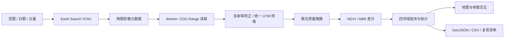

# TerraLens · 地表变化证据工作台

**在浏览器里，从真实卫星影像得到可追溯的变化结果。**

TerraLens 是一个云原生遥感分析作品：通过 STAC 发现 Sentinel-2 L2A 影像，用 HTTP Range 按需读取 COG 波段，在 Web Worker 中构建统一网格，再交互式计算光谱变化、提取连通斑块并导出证据。附带真实历史影像窗口，第一次打开无需申请 API 密钥。

适合遥感 / GIS 学习展示、小区域变化探索和前端地理计算研究。**当前是有测试和真实数据的 1.0 研究原型，尚未完成生产环境验收；不声称具备 AI 大模型推理。**

## 直接体验

安装 Node.js 24，然后在项目目录运行：

```bash
npm ci
npm run dev
```

打开终端显示的本地地址。页面默认加载 **Paradise, California，2018-11-06 与 2018-12-11** 的真实 Sentinel-2 窗口。

1. 切换“前后对比 / 变化强度 / 对比期指数”。
2. 在右侧选择 NBR 或 NDVI，调整下降阈值和最小斑块。
3. 在表格中高亮一个斑块，查看统计。
4. 导出 GeoJSON、CSV 或完整复现清单。
5. 要换地区，修改 WGS84 范围、日期和云量，检索后选同一瓦片内的两期影像，再点击“从云端读取并分析”。修改检索条件不会悄悄改变旧结果；结果上方一直显示实际分析区域和日期。

## 已实现

| 能力 | 实现方式 |
| --- | --- |
| 公开影像检索 | Element 84 Earth Search STAC；日期、范围、整景云量筛选 |
| 云原生数据读取 | GeoTIFF.js + 有限重试的 HTTP Range 客户端，不下载整景 |
| 浏览器后台计算 | Web Worker，实时进度、超时和取消 |
| 波段一致性 | 检查投影、覆盖范围、像元对齐；读取各资产 scale / offset |
| 联合质量掩膜 | 两期均保留 SCL 4 / 5 / 6，屏蔽云、阴影、不确定与无效数据 |
| 地表变化分析 | NDVI / NBR 差分；四邻域连通斑块、小斑块过滤 |
| 可交互制图 | MapLibre、真彩色分界滑杆、变化配色、斑块高亮 |
| 可追溯输出 | GeoJSON / CSV / 包含原始 STAC 与参数的 JSON 清单 |
| 自带真实案例 | 真实反射率窗口 + 元数据 + SHA-256 完整性记录 |
| 自动检查 | 单元测试、真实数据一致性测试、类型检查、代码检查、GitHub CI |
| 独立静态构建 | 除 Sites 构建外，支持不依赖 Sites 账号的 GitHub Pages 静态输出 |

## 技术栈与数据流

React 19、TypeScript、MapLibre GL、GeoTIFF.js、Proj4、Vite / Vinext。



## 方法说明

- `NDVI = (NIR − RED) / (NIR + RED)`。
- `NBR = (NIR − SWIR22) / (NIR + SWIR22)`。
- 图中 `Δ = 对比期 − 基准期`；负值表示指数下降。**这个符号与常见 dNBR = 火前 − 火后的定义相反，不套用常规 dNBR 分级。**
- 各反射率资产按 `DN × scale + offset` 计算。NoData、负反射率、非有限数、近零分母排除。
- 分析网格固定为 60 m，最近邻选取每个目标网格中心对应的原始像元；10 m 和 20 m 波段使用同一空间位置，避免简单缩放产生左上角偏移。
- 研究范围先转换为同一 UTM 投影，向外对齐网格；以网格中心是否落入原始 WGS84 矩形作边界掩膜。
- 面积为 `像元数 × 60 × 60 / 10000` 公顷，不是全分辨率面积或测绘面积。
- 每个斑块先沿行合并网格带，再在整数网格上执行多边形并集，消除共边并保留孔洞，最后投影为 WGS84 MultiPolygon；不把外接矩形当成变化范围。
- 平均值与比例只使用两期共同有效像元；“下降区域面积”包含所有越过阈值的像元，斑块表另施加最小像元数过滤。

详见 [方法与限制](docs/METHODS.md) 和 [技术调研](docs/REFERENCES.md)。

## 常用命令

```bash
npm run typecheck       # TypeScript
npm run lint            # 应用代码检查（生成的未改动 shadcn 组件单独排除）
npm test               # 核心算法与真实样例一致性
npm run build          # Sites / Cloudflare Worker 构建
npm run build:github   # 独立静态网站，输出 out/
npm run data:refresh   # 重新读取公开卫星窗口，网络请求可能耗时数分钟
```

`data:refresh` 对已完整读取的影像窗口保存在 `.cache/`，下次可复用；它不会上传个人数据。要重新从源头取数，可将这个项目的 `.cache` 目录重命名后运行。样例不是实时数据，采集日期与读取时间分别存储。

## 上传 GitHub

本目录就是仓库根目录。建议仓库名 `terralens`，简介可写：

> Cloud-native satellite change analysis in the browser. STAC discovery, COG window reads, quality masking and reproducible geospatial evidence.

上传源码、`public/data`、锁文件、测试和文档；`.gitignore` 已排除依赖、缓存、构建产物和本地环境文件。不要上传 `node_modules`。

```bash
git init
git add .
git commit -m "Initial TerraLens release"
git branch -M main
git remote add origin https://github.com/YOUR_NAME/terralens.git
git push -u origin main
```

如果交付目录已有 Git 仓库，跳过 `git init` 和初始提交；上传到你的 GitHub 仓库前确认远程地址。交付 ZIP 不包含 `.git`。

### GitHub Pages

`npm run build:github` 会生成独立的 `out/` 静态站点，使用相对资源路径，可放到 GitHub Pages 仓库子路径。可通过 GitHub Actions 将 `out` 作为 Pages artifact 发布；目前附带的工作流**只执行检查，不自动发布**。也可将 `out/` 部署到任意静态托管服务。

开发脚手架的 `.openai/hosting.json` 包含原始 Sites 项目标识，标识不是密钥，静态构建不会使用它。要用你自己的 Sites 账号重新部署，请先移除其中的 `project_id`，创建自己的站点。

## 项目结构

```text
app/workbench.tsx          工作台与分析交互
components/analysis-map.tsx 地图与栅格显示
lib/geo/catalog.ts        STAC 查询与输入检查
lib/geo/cog.ts            数据窗口、校正与共同网格
lib/geo/range-client.ts   有限重试 / 超时 / Range 限制
lib/geo/sampling.ts       共同目标像元中心抽样
lib/geo/analysis.ts       指数、质量掩膜和连通斑块
lib/geo/export.ts         证据清单与地理数据导出
scripts/prepare-sample.ts 真实样例再生成
public/data/              真实窗口与 SHA-256
tests/                    算法和样例一致性测试
docs/                     方法、调研、验证记录
```

## 数据许可与参考

Contains modified Copernicus Sentinel data (2018), accessed through Element 84 Earth Search / Sentinel-2 COGs. 代码采用 MIT 许可，卫星数据不随代码重新授予 MIT 许可，使用时保留 Copernicus 来源说明。可选底图 © OpenStreetMap contributors。

项目参考 [GeoAI.js](https://github.com/decision-labs/geoai.js) 的浏览器地理处理思路、[Earth Search](https://github.com/Element84/earth-search) 的公开目录和 [GeoTIFF.js](https://github.com/geotiffjs/geotiff.js) 的按需数据读取能力；应用界面与分析实现为本项目编写，未复制其品牌或声称与其有从属关系。
